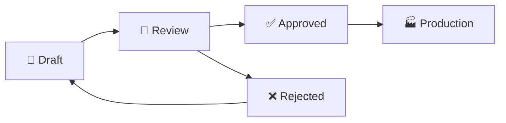

# SignageERP - Requirements (Single-Tenant MVP)

**Project Status:** ✅ SCOPE CONFIRMED - Single-Tenant MVP  
**Date:** 2026-02-10  
**Type:** ERP System for Signage Shop (Single Organization)

---

## 🎯 Project Vision (Updated)

**Focus:** Build a working ERP for ONE signage shop first, then expand to Multi-tenant SaaS later.

**Why Single-Tenant First:**

- ✅ Faster development (~4 weeks vs 4-5 months)
- ✅ Validate business logic with real shop
- ✅ Lower complexity (no organizationId everywhere)
- ✅ Can upgrade to Multi-tenant in Phase 2

---

## ✅ MVP Scope (Phase 1 - 4 Weeks)

### 1. 🧶 Stock Management System (Week 1)

**Priority: P0 (Must Have)**

Features:

- Material master (name, type, unit, costPrice, sellingPrice)
- Stock IN (purchase recording)
- Stock OUT (usage tracking)
- Current balance view
- Low stock alerts
- Stock history (audit trail)

**Deliverables:**

- Prisma models: Material, StockTransaction
- CRUD APIs (Server Actions)
- UI: Material list, Stock IN/OUT forms, Dashboard widget

---

### 2. 📦 Order Management - Kanban (Week 2)

**Priority: P0 (Must Have)**

Features:

- **Sales Board**: New → Quoted → Approved → Completed
- **Production Board**: Printing → Finishing → QC → Ready
- Manual drag-and-drop (NO automation)
- Basic card info (customer, size, deadline)

**Deliverables:**

- Prisma models: Order, OrderItem
- Kanban UI (drag-and-drop)
- Status update logic

**DEFERRED to Phase 2:**

- ❌ WIP Limits
- ❌ Auto-reserve materials
- ❌ Automation rules
- ❌ LINE notifications

---

### 3. 🧾 Accounting Module (Week 3)

**Priority: P0 (Must Have)**

Features:

- **Quotation**: Create quote with pricing
- **Invoice**: Generate PDF invoice
- **Receipt**: Generate PDF receipt
- **Payment Tracking**: Record payment status (Paid/Unpaid)

**Deliverables:**

- Prisma models: Quotation, Invoice, Payment
- PDF generation (using library)
- Payment recording UI

**DEFERRED to Phase 2:**

- ❌ e-Tax Invoice
- ❌ Auto-accounting (Dr/Cr)
- ❌ Partial payments
- ❌ Cost analysis per job

---

### 4. 📊 Executive Dashboard (Week 4)

**Priority: P0 (Must Have)**

Features:

- **Today's Sales**: Total revenue today
- **Pending Jobs**: Count of incomplete orders
- **Urgent Jobs**: Orders due in 3 days (red alert)
- **Mobile-Responsive**: Works on phone/tablet

**Deliverables:**

- Dashboard page with widgets
- Mobile-first design (TailwindCSS)
- Real-time data (no caching needed for MVP)

**DEFERRED to Phase 2:**

- ❌ Real-time P&L calculation
- ❌ Staff performance tracking
- ❌ Advanced analytics

---

### 5. 🎨 Pricing Engine (Already Exists!)

**Priority: P0 (Must Have)**

**Current Status:**

- ✅ Material model with costPrice, sellingPrice, wasteFactor
- ✅ PricingTier model with discounts
- ✅ Seed data (Vinyl, Acrylic)

**Integration:**

- Use in Quotation module
- Calculate price based on Material + Quantity
- Apply tiered discounts

**No New Work Needed** - Just connect to Quotation form

---

## 🏗️ Technical Architecture

### Database: Supabase PostgreSQL

- Location: Already setup
- Connection: `apps/api/.env` (DATABASE_URL)

### Backend: NestJS (apps/api)

- Prisma ORM
- Server Actions for CRUD
- No complex middleware (keep simple)

### Frontend: Next.js 15 (apps/web)

- App Router
- HeroUI v3 / Shadcn UI
- Server Components + Client Components

### Shared: packages/types

- TypeScript interfaces synced with Prisma

---

## 📋 Feature Priority Matrix

| Feature | Priority | MVP? | Phase |
|---------|----------|------|-------|
| Stock Management | P0 | ✅ | 1 |
| Kanban (Manual) | P0 | ✅ | 1 |
| Quotation | P0 | ✅ | 1 |
| Invoice PDF | P0 | ✅ | 1 |
| Dashboard | P0 | ✅ | 1 |
| Pricing Engine | P0 | ✅ | 1 (exists) |
| --- | --- | --- | --- |
| WIP Limits | P1 | ❌ | 2 |
| Auto-deduction | P1 | ❌ | 2 |
| e-Tax Invoice | P1 | ❌ | 2 |
| Design Files | P1 | ❌ | 2 |
| Production Photos | P2 | ❌ | 2 |
| HR/Payroll | P3 | ❌ | 3 |
| Multi-tenancy | P3 | ❌ | 3 |

---

## 🚀 Phase 2 & 3 (Future)

### Phase 2: Automation & Polish (Month 2-3)

- WIP Limits on Kanban
- Auto-deduct stock on Order confirm
- Design file management
- Production tracking photos
- e-Tax invoice

### Phase 3: Multi-Tenant SaaS (Month 4+)

- Add `organizationId` to all tables
- Tenant isolation middleware
- Subscription billing
- User roles per organization

---

## 📅 Timeline

**Total MVP:** 4 weeks (1 month)

| Week | Focus | Deliverable |
|------|-------|-------------|
| 1 | Stock Management | Material CRUD + Stock tracking |
| 2 | Kanban Board | Manual order workflow |
| 3 | Accounting | Quotation + Invoice PDF |
| 4 | Dashboard | Executive summary + Polish |

**Launch Target:** End of Week 4

---

## 🎯 Success Criteria

MVP is successful if:

- ✅ เจ้าของร้านดู Dashboard แล้วรู้ยอดขายวันนี้
- ✅ ช่างดู Kanban แล้วรู้ว่ามีงานอะไรต้องทำ
- ✅ พนักงานดูสต็อกแล้วรู้ว่าวัสดุเหลือเท่าไหร่
- ✅ ออกใบเสนอราคาและใบแจ้งหนี้ได้

---

## 📝 Assumptions

1. **Single Organization**: ร้านเดียว ไม่ต้องกังวลเรื่อง multi-tenancy
2. **Manual Processes**: ยอมรับว่าบางอย่างทำด้วยมือก่อน (ย้ายการ์ด Kanban เอง)
3. **Simple Pricing**: ใช้ Pricing Engine พื้นฐาน ไม่ซับซ้อน
4. **PDF Export**: ใช้ library สำเร็จรูป (ไม่เขียน PDF engine เอง)

---

## ⚠️ Out of Scope (Phase 1)

- ❌ Multi-tenant architecture
- ❌ Kanban automation (auto-move cards)
- ❌ Auto material reservation
- ❌ Real-time notifications (LINE/Email)
- ❌ Advanced reporting
- ❌ Mobile app (แค่ responsive web)
- ❌ HR/Payroll

---

**Status:** ✅ READY TO START DEVELOPMENT

**Next Step:** Begin Week 1 - Stock Management System

---

## 🎯 Updated Vision

**From:** Single-tenant ERP for one shop  
**To:** **Multi-tenant SaaS platform** serving multiple signage shops

**Impact:** This is a MAJOR architectural change that affects:

- Database design (all tables need `organizationId`)
- Authentication & Authorization (tenant isolation)
- File storage strategy (per-tenant buckets)
- Billing & subscription management
- Support & maintenance complexity
- Development timeline (×3-5 longer)

---

## ❓ CRITICAL QUESTIONS (Must Answer Before Proceeding)

### 🏢 1. Business Model

**Q1.1: Target Market Size**

- [ ] How many shops do you plan to serve in Year 1? (10? 50? 100?)
- [ ] Is this for Thai market only or international?
- [ ] Shop size: Small (1-5 employees) vs Large (20+ employees)?

**Q1.2: Pricing Strategy**

- [ ] Monthly subscription per shop? (฿X/month)?
- [ ] Per-user pricing? (฿X/user/month)?
- [ ] Freemium model? (Free tier + paid features)?
- [ ] One-time payment?

**Q1.3: Revenue Goals**

- [ ] Break-even target: ฿X/month from Y customers?
- [ ] Is this your main business or side project?

---

### 🏗️ 2. Technical Architecture

**Q2.1: Multi-tenancy Model**

Option A: **Shared Database + organizationId** (Easier, cheaper)

```sql
CREATE TABLE orders (
  id UUID PRIMARY KEY,
  organizationId UUID NOT NULL, -- Tenant isolation
  ...
);
```

✅ Pros: Easier to maintain, lower cost  
❌ Cons: Data isolation risk, query complexity

Option B: **Separate Database per Tenant** (More isolated)

```
tenant-shop1.signage-erp.com → Database: shop1_db
tenant-shop2.signage-erp.com → Database: shop2_db
```

✅ Pros: Perfect isolation, easier backup  
❌ Cons: Complex, expensive, scaling issues

**Which model do you prefer?**

- [ ] Option A (Recommended for MVP)
- [ ] Option B
- [ ] Hybrid (VIP customers get separate DB)

**Q2.2: File Storage**

Design files are LARGE (100MB-1GB per file)

Option A: **Cloud Storage (AWS S3 / Google Cloud Storage)**

- Cost: ~฿0.70/GB/month storage + bandwidth
- ✅ Scalable, reliable
- ❌ Monthly cost grows with usage

Option B: **Self-hosted NAS**

- Cost: One-time ฿30,000-100,000
- ✅ No recurring cost
- ❌ You manage backup/security

Option C: **Hybrid** (thumbnails in cloud, source files in NAS)

**Which option?**

- [ ] Cloud (S3/GCS)
- [ ] Self-hosted NAS
- [ ] Hybrid

**Q2.3: Authentication Strategy**

- [ ] Simple email/password only?
- [ ] Google/Facebook OAuth?
- [ ] SAML/SSO for enterprise customers?
- [ ] 2FA required?

---

### 📦 3. Feature Prioritization

You listed many modules. **Which are MVP (must-have for launch)?**

Rate each: P0 (Must have), P1 (Should have), P2 (Nice to have), P3 (Future)

| Feature | Priority | Notes |
|---------|----------|-------|
| **Multi-tenancy** | P? | Foundation |
| **User Management** | P? | Users, roles, permissions |
| **Dynamic Pricing** | P? | Formula-based pricing |
| **Quote/Order** | P? | Basic sales flow |
| **Design File Management** | P? | Version control, auto naming |
| **Production Tracking (Kanban)** | P? | iPad-friendly |
| **Inventory** | P? | Stock management |
| **Finance/Accounting** | P? | Income/expense tracking |
| **HR/Payroll** | P? | Employee management |
| **Reports & Analytics** | P? | Dashboard, charts |
| **Mobile App** | P? | Native iOS/Android |
| **API for integrations** | P? | External systems |

**Please fill in P0/P1/P2/P3 for each**

---

### 🎨 4. Design File Management Details

**Q4.1: File Naming Convention**

You mentioned auto-naming like `JOB-001-V1`.

**Format:**

```
{PREFIX}-{JOB_NUMBER}-{VERSION}-{STATUS}.{ext}
Example: PRINT-00123-V3-APPROVED.ai
```

**Variables needed:**

- PREFIX options? (PRINT, INSTALL, DESIGN, etc.)
- JOB_NUMBER format? (5 digits? per tenant? globally unique?)
- VERSION increment: Auto or manual?

**Q4.2: Version Control Workflow**



**States:**

- Draft (กำลังออกแบบ)
- Review (รอลูกค้าดู)
- Approved (ลูกค้าอนุมัติแล้ว)
- Production (ใช้ในการผลิต)
- Rejected (ไม่ผ่าน กลับไปแก้)

**Is this workflow correct?** Or need changes?

**Q4.3: File Storage Schema**

```typescript
interface DesignFile {
  id: string;
  organizationId: string; // Tenant
  jobId: string;          // Link to Job/Order
  
  // Auto-generated name
  fileName: string;       // "PRINT-00123-V3-APPROVED.ai"
  
  // File info
  originalName: string;   // Original upload name
  fileUrl: string;        // S3/NAS URL
  thumbnailUrl: string;   // Preview image
  fileSize: number;       // Bytes
  mimeType: string;       // application/postscript
  
  // Version control
  version: number;        // 1, 2, 3...
  status: 'draft' | 'review' | 'approved' | 'production' | 'rejected';
  
  // Metadata
  uploadedBy: string;     // User ID
  approvedBy?: string;
  approvedAt?: Date;
  
  // For designers
  notes?: string;
  tags?: string[];        // searchable
  
  createdAt: Date;
  updatedAt: Date;
}
```

**Does this cover your needs?** Missing anything?

---

### 🏭 5. Production Tracking

**Q5.1: Kanban Columns**

You mentioned: รอผลิต → กำลังทำ → เสร็จ

**Detailed workflow:**

```
1. ใหม่ (New Order)
2. รอออกแบบ (Pending Design)
3. รออนุมัติ (Pending Approval)
4. รอผลิต (Ready to Produce)
5. กำลังพิมพ์ (Printing)
6. กำลังติดตั้ง (Installing)
7. เสร็จสิ้น (Completed)
8. ยกเลิก (Cancelled)
```

**Is this accurate?** Or simpler workflow?

**Q5.2: iPad Interface**

ช่างดูใบสั่งงานผ่าน iPad:

**Requirements:**

- Read-only หรือ update สถานะได้?
- Need offline mode? (ทำงานในโรงงานไม่มีเน็ต)
- Show photos/drawings?
- QR code scanning?

**Q5.3: Material Tracking**

ตัดสต็อกอัตโนมัติเมื่อสั่งผลิต

**Logic:**

```
Order confirmed → 
  Check material stock →
  If sufficient: Auto-deduct →
  If insufficient: Alert/Block order
```

**Questions:**

- Block order ถ้าสต็อกไม่พอ? หรืออนุญาตให้ติดลบ?
- Minimum stock alert? (แจ้งเตือนเมื่อเหลือต่ำกว่า X)
- Material cost tracking? (ราคาต้นทุนเฉลี่ย)

---

### 💰 6. Finance & Accounting

**Q6.1: Accounting Features**

| Feature | Needed? | Notes |
|---------|---------|-------|
| รายรับ-รายจ่าย basic | ☐ | Simple ledger |
| Cash flow tracking | ☐ | เงินเข้า-ออก |
| Invoice generation | ☐ | PDF ใบแจ้งหนี้ |
| Receipt generation | ☐ | PDF ใบเสร็จ |
| Tax calculation (VAT) | ☐ | 7% VAT |
| Withholding tax | ☐ | หัก ณ ที่จ่าย 3% |
| Integration with accounting software | ☐ | Export to Express/SAP? |

**Q6.2: Payment Tracking**

- Track partial payments? (มัดจำ 50%, ชำระเต็ม)
- Multiple payment methods? (เงินสด, โอน, บัตร)
- Credit terms? (เครดิต 30/60 วัน)

---

### 👥 7. HR & Payroll (Future)

**Q7.1: HR Features**

For future planning:

- Employee database (ข้อมูลพนักงาน)
- Attendance tracking (บันทึกเวลาเข้า-ออก)
- Leave management (ลา)
- Salary calculation (คำนวณเงินเดือน)
- Commission tracking (คอมมิชชั่นเซลล์)

**Timeline:** Phase X? (เมื่อไหร่ต้องการ)

---

### 📊 8. Reports & KPI

**Q8.1: Essential Reports**

| Report | Priority | Description |
|--------|----------|-------------|
| Sales Report | P? | ยอดขายต่อวัน/เดือน |
| Profit & Loss | P? | กำไร-ขาดทุน |
| Material Usage | P? | วัสดุที่ใช้ไป |
| Designer Performance | P? | KPI กราฟิก |
| Salesperson Performance | P? | KPI เซลล์ |
| Production Efficiency | P? | เวลาผลิตเฉลี่ย |

**Which reports are P0 (must-have)?**

---

## 📅 9. Timeline & Resources

**Q9.1: Timeline**

- Launch target: ___ months from now?
- MVP features must be ready by: ___?
- Full product: ___?

**Q9.2: Team**

- Solo dev (you only)?
- Planning to hire? (When? How many?)
- Have designer for UI/UX?

**Q9.3: Budget**

- Monthly cloud cost budget: ฿___/month?
- Development tools: ฿___?
- Marketing budget: ฿___?

---

## 🎯 Recommended MVP Scope (My Suggestion)

Based on complexity, I suggest **MVP** should include:

### Phase 0: Foundation (2-4 weeks)

- ✅ Multi-tenant architecture (organizationId model)
- ✅ User authentication & authorization
- ✅ Organization/Shop management
- ✅ Basic dashboard

### Phase 1: Core Sales (4-6 weeks)

- ✅ Dynamic pricing engine (formula-based)
- ✅ Customer management
- ✅ Quote creation
- ✅ Order management
- ✅ Simple invoice PDF

### Phase 2: Design Files (2-3 weeks)

- ✅ File upload to cloud
- ✅ Auto file naming
- ✅ Version control (draft/approved)
- ✅ Thumbnail generation

### Phase 3: Production (3-4 weeks)

- ✅ Kanban board (basic)
- ✅ Status updates
- ✅ Material tracking (basic)

### Phase 4: Polish (2-3 weeks)

- ✅ Reports (basic)
- ✅ Mobile-responsive UI
- ✅ Performance optimization

**Total: ~4-5 months for MVP** (solo dev, part-time)

**Defer to Phase 2 (post-launch):**

- ❌ HR/Payroll
- ❌ Advanced accounting
- ❌ Native mobile app
- ❌ Complex integrations

---

## 📋 Action Items

**Before we can proceed, please provide:**

1. **[ ] Answers to all "Q" questions above**
2. **[ ] Priority (P0/P1/P2/P3) for each feature**
3. **[ ] Timeline expectations**
4. **[ ] Budget constraints**

**Optional but helpful:**
5. **[ ] Example: ใบเสนอราคาจากร้านจริง** (PDF/photo)
6. **[ ] Example: ไฟล์กราฟิกปัจจุบันชื่ออย่างไร** (screenshot naming)
7. **[ ] Current workflow diagram** (ถ้ามี)

---

## 🚨 Risk Assessment

| Risk | Impact | Mitigation |
|------|--------|------------|
| **Scope too large for solo dev** | High | Cut features, focus MVP |
| **Multi-tenancy bugs (data leakage)** | Critical | Comprehensive testing, Row-Level Security |
| **File storage costs explode** | Medium | Set upload limits, compress thumbnails |
| **No customers** | High | Validate market first, pre-sell |
| **Competitor launches first** | Medium | Speed up MVP, find niche |

---

**Status:** ⏸️ WAITING FOR REQUIREMENTS CLARIFICATION

Once you provide answers, I will create:

1. Updated Implementation Plan
2. Database Schema (ERD)
3. API Specification
4. Realistic Timeline & Milestones
5. ClickUp Task Breakdown
