# 🏗️ Signage ERP (PrintFlow) Blueprint

This blueprint serves as a comprehensive technical and functional specification for recreating or expanding the Signage ERP (PrintFlow) system.

## 🌟 1. System Overview

**PrintFlow ERP** is a modern, high-performance management system designed specifically for signage manufacturing businesses. It streamlines the entire workflow from initial customer inquiry to final installation.

---

## 🔄 2. Core Business Workflows (Flow Design)

### 📈 Sales & Quotation Flow

### 🏭 Production & Kanban Flow

```mermaid
graph LR
    New[🆕 New Order] --> Design[🎨 Designing]
    Design --> Approval[👀 Pending Approval]
    Approval --> Prod[🏭 Production]
    Prod --> Install[🚚 Installation]
    Install --> Done[✅ Done]
    
    Approval -- Revision Needed --> Design
```

---

## 🗄️ 3. Database Architecture (ERD)

---

## 💻 4. Technology Stack (2026 Standards)

| Layer | Technology | Version / Choice |
|-------|------------|------------------|
| **Frontend** | Next.js | 15.1.7 (App Router) |
| **UI Library** | HeroUI | v2.8.8 (Standard) |
| **Styling** | Tailwind CSS | v4 (Utility-first) |
| **Backend** | Next.js Server Actions | Type-safe Actions |
| **Database** | PostgreSQL | Supabase |
| **ORM** | Prisma | 5.22.0 |
| **Auth** | NextAuth / Supabase Auth | Tenant-aware |
| **Types** | TypeScript | 5.x |

---

## 🎯 5. Core Use Cases

### 🛠️ Use Case 1: Digital Pricing Calculation

- **User**: Sales Representative
- **Action**: Enters dimensions (W x H) and selects "Glossy Vinyl".
- **Benefit**: Instant, error-free price calculation including waste factors and tiered discounts.

### 📋 Use Case 2: Visual Production Tracking

- **User**: Production Manager
- **Action**: Drags an order from "Designing" to "Production" on the Kanban board.
- **Benefit**: Real-time visibility into shop floor capacity and bottleneck detection.

### 📦 Use Case 3: Automated Stock Management

- **User**: Stock Controller
- **Action**: Receives alert for low "3mm Acrylic Sheets".
- **Benefit**: Prevents production delays by ensuring raw materials are always available.

---

## 🚀 6. Execution Roadmap

1. **Setup Monorepo**: Apps (Web/API) + Packages (Database/Types/UI).
2. **Schema Definition**: Implement Prisma models for core entities.
3. **Pricing Engine**: Build the core logic for cost calculation.
4. **Sales Board**: Implement the basic order-to-production flow.
5. **Automation**: Add stock deduction and notification logic.
