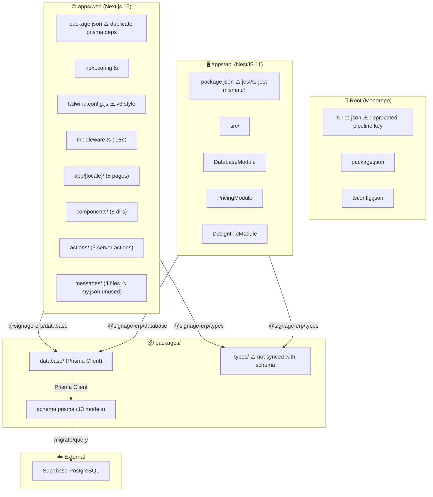

# 🔍 SignageERP System Audit Report

> **วันที่ตรวจ:** 11 กุมภาพันธ์ 2568 (2025-02-11)
> **สถานะ:** รายงานผลเท่านั้น — **ยังไม่แก้ไขอะไร**
> **วัตถุประสงค์:** สแกนโครงสร้างทั้งระบบจากกว้าง→ลึก บันทึกทุกอย่างที่พบเจอ

---

## 📁 1. โครงสร้าง Monorepo (Root)

| Path | สถานะ | หมายเหตุ |
|---|---|---|
| `apps/web` | ✅ Active | Next.js 15.1.7 + React 19 |
| `apps/api` | ✅ Active | NestJS 11 |
| `apps/packages/` | ⚠️ **Empty dir** | โฟลเดอร์ว่าง ไม่มีไฟล์ใดๆ — ควรลบ |
| `packages/database` | ✅ Active | Prisma 5.22, PostgreSQL (Supabase) |
| `packages/types` | ✅ Active | Shared TypeScript types |
| `prisma/` (root) | ⚠️ **Empty dir** | โฟลเดอร์ว่างที่ root — เป็น artifact เก่า ควรลบ |
| `build_log.txt` | ⚠️ Stale file | Build log ไม่ควรอยู่ใน repo |
| `npm` | ⚠️ Unknown file | ไฟล์ `npm` ที่ root — ไม่รู้ที่มา ควรตรวจสอบ |

---

## ⚙️ 2. Turbo Config

**ไฟล์:** [turbo.json](file:///d:/PrintFlowERP/turbo.json)

> [!WARNING]
> ใช้ key `"pipeline"` ซึ่ง **deprecated** ตั้งแต่ Turbo v2  
> ควรเปลี่ยนเป็น `"tasks"` (Turbo v2+ syntax)

- ❌ ไม่มี `generate` task สำหรับ Prisma generate
- ❌ ไม่มี dependency จาก `build` → `generate` (Prisma Client อาจไม่ถูก generate ก่อน build)

---

## 🔧 3. TypeScript Config — **ไม่สอดคล้องกัน**

| Location | `target` | `module` | `moduleResolution` |
|---|---|---|---|
| Root `tsconfig.json` | `ES2020` | `commonjs` | `node` |
| `apps/web/tsconfig.json` | `ES2017` | `esnext` | `bundler` |
| `apps/api/tsconfig.json` | `es2022` | `nodenext` | `nodenext` |
| `packages/types/tsconfig.json` | *(not checked)* | — | — |

> [!IMPORTANT]
>
> - Root tsconfig ใช้ `commonjs` ซึ่งไม่เหมาะกับ monorepo สมัยใหม่
> - ทั้ง 3 ที่ใช้ `target` คนละค่า — ขาดการอ้างอิง root config
> - `apps/api` ไม่มี `include`/`exclude` ใน `tsconfig.json` (มีแค่ใน `tsconfig.build.json`)

---

## 🌐 4. apps/web (Next.js Frontend)

### 4.1 Dependencies

> [!CAUTION]
> `apps/web/package.json` ยังมี `@prisma/client: "5.22.0"` และ `prisma: "5.22.0"` ใน dependencies  
> **ทั้งที่ก็มี `@signage-erp/database: "*"` อยู่แล้ว — ซ้ำซ้อน!**

- `playwright: "^1.58.2"` อยู่ใน `dependencies` แทนที่จะอยู่ใน `devDependencies`
- `next-themes: "^0.4.6"` อยู่ใน root `package.json` แทนที่จะอยู่ใน `apps/web`

### 4.2 i18n — Locale Mismatch

| ไฟล์ message | middleware.ts | navigation.ts | layout.tsx |
|---|---|---|---|
| `en.json` ✅ | `en` ✅ | `en` ✅ | `en` ✅ |
| `th.json` ✅ | `th` ✅ | `th` ✅ | `th` ✅ |
| `mm.json` ✅ | `mm` ✅ | `mm` ✅ | `mm` ✅ |
| **`my.json`** ⚠️ | ❌ ไม่มี | ❌ ไม่มี | ❌ ไม่มี |

> [!WARNING]
> มีไฟล์ `messages/my.json` (5,335 bytes) แต่ไม่ได้ลงทะเบียนใน middleware, navigation, หรือ layout  
> ต้องตัดสินว่า: **เพิ่ม `my` locale** หรือ **ลบ `my.json`**

### 4.3 Tailwind CSS v4 vs v3 Config

> [!WARNING]
>
> - ใช้ `tailwindcss: "^4"` และ `@tailwindcss/postcss: "^4"` (Tailwind v4)
> - แต่ `tailwind.config.js` เขียนเป็นรูปแบบของ **v3** (CommonJS + `module.exports`)
> - มีไฟล์ `hero.ts` ที่ export HeroUI plugin สำหรับ v4
> - Tailwind v4 ใช้ CSS-based config (`@theme`, `@plugin`, `@source`) ไม่ใช้ `tailwind.config.js`

### 4.4 Next.js Metadata API

**ไฟล์:** [layout.tsx](file:///d:/PrintFlowERP/apps/web/app/%5Blocale%5D/layout.tsx)

> [!WARNING]
> `metadata.viewport` และ `metadata.themeColor` ถูก **deprecated** ใน Next.js 15  
> ควรแยกออกเป็น `export const viewport: Viewport = { ... }`

### 4.5 Stale/Misc Files

| ไฟล์ | ปัญหา |
|---|---|
| `capture_kanban.js` | Script สำหรับ capture screenshot — ไม่ควรอยู่ใน source |
| `test-db.mjs` | Script ทดสอบ DB — ไม่ควรอยู่ใน source |
| `public/quote-screenshot.png` | 354KB screenshot — เป็น asset ถาวรหรือ temp? |

---

## 🖥️ 5. apps/api (NestJS Backend)

### 5.1 Modules

```
AppModule
├── DatabaseModule (PrismaService)
├── PricingModule (PricingController + PricingService)
└── DesignFileModule (DesignFileController + DesignFileService)
```

- ✅ ใช้ `@signage-erp/database` สำหรับ PrismaClient แล้ว (refactored)
- ✅ CORS configured สำหรับ `localhost:3000` และ `localhost:3001`
- ✅ Global prefix: `/api`

### 5.2 Dependencies

> [!WARNING]
> `jest: "^30.0.0"` กับ `ts-jest: "^29.2.5"` — **major version mismatch!**  
> Jest 30 ไม่ compatible กับ ts-jest 29

### 5.3 Stale Files

| ไฟล์ | ปัญหา |
|---|---|
| `env` (ไม่มี dot) | ดูเหมือนไฟล์ถูก copy มาผิด (content เหมือน `.env`) |

---

## 📦 6. packages/database

### 6.1 Package Config

- `main: "./index.ts"` — ชี้ไปที่ `.ts` ตรงๆ (ไม่ใช่ `.js`)
  - ✅ OK สำหรับ monorepo ที่ transpile ที่ฝั่ง consumer
  - ⚠️ แต่ไม่มี `exports` field ใน `package.json` (best practice สำหรับ modern Node.js)

### 6.2 Prisma Schema Issues

**ไฟล์:** [schema.prisma](file:///d:/PrintFlowERP/packages/database/prisma/schema.prisma)

| Issue | Detail |
|---|---|
| **Commented-out relation** | `DesignFile.organization` relation ถูก comment ออก (L258) — ต้องตัดสินว่าจะใช้หรือไม่ |
| **User model ไม่สมบูรณ์** | มีแค่ `id`, `name`, `email` — ไม่มี `role`, `password`, `organizationId` |
| **User ไม่มี relation กับ Organization** | ทุก model อื่นมี `organizationId` ยกเว้น `User` |
| **Order.status เป็น String** | ใช้ `String @default("DRAFT")` แทนที่จะเป็น enum |
| **DesignFile.status เป็น String** | ใช้ `String @default("draft")` — case ไม่ตรงกับ Order.status (`DRAFT` vs `draft`) |
| **ไม่มี index definitions** | ไม่มี `@@index` สำหรับ foreign keys ที่ query บ่อย |

---

## 📋 7. packages/types vs Prisma Schema — **ไม่ Sync**

> [!CAUTION]
> Types package กำหนด types แยกจาก Prisma schema โดยสิ้นเชิง  
> หลาย types ไม่ตรงกัน:

| Item | `packages/types` | Prisma Schema |
|---|---|---|
| `UnitType` enum | `METER, SQUARE_METER, PIECE, SET, HOUR` | `SQM, LINEAR_METER, PIECE` |
| `User.role` | `UserRole` enum (5 roles) | ❌ ไม่มี role field |
| `User.username` | มี | ❌ ไม่มี |
| `User.isActive` | มี | ❌ ไม่มี |
| `Product.type` | `ProductType` enum | ❌ ไม่มีใน schema |
| `Quote` | ใช้ `QuoteStatus` enum | Schema ใช้ `DocumentStatus` enum |
| `Order.status` | `OrderStatus` enum (5 values) | `String` (free text) |
| `ProductionJob` | มี type สมบูรณ์ | ❌ ไม่มี model ในschema |
| `Customer.email` | มี | ❌ ไม่มีใน schema |
| `Customer.isActive` | มี | ❌ ไม่มีใน schema |

---

## 🔒 8. Security & Environment

| Item | สถานะ | หมายเหตุ |
|---|---|---|
| `.env` in `.gitignore` | ✅ OK | `.env` และ `.env*.local` ถูก ignore |
| `.env` files (3 ชุด) | ⚠️ Duplicated | `apps/web/.env`, `apps/api/.env`, `packages/database/.env` มี content เหมือนกัน |
| DB Credentials ใน `.env` | ✅ Normal | ใช้ Supabase connection pooling + direct URL |
| Auth system | ❌ **ไม่มี** | ไม่มี authentication/authorization ใดๆ ทั้ง frontend และ backend |

---

## 📊 9. สรุปปัญหาตามระดับความสำคัญ

### 🔴 Critical (ต้องแก้ก่อน build/deploy)

1. **`apps/web` — Prisma dependency ซ้ำซ้อน** — `@prisma/client` + `prisma` ยังอยู่ใน deps ทั้งที่ใช้ `@signage-erp/database` แล้ว
2. **Jest/ts-jest version mismatch** ใน `apps/api` — จะ fail ตอน test
3. **Tailwind v4 config format ผิด** — ใช้ v3 config style กับ v4 runtime

### 🟡 Important (ควรแก้เร็ว)

1. **Types ↔ Schema ไม่ sync** — source of truth ไม่ชัด ทำให้ type safety เสีย
2. **Turbo `pipeline` deprecated** — ควรเปลี่ยนเป็น `tasks`
3. **Turbo ไม่มี `generate` task** — Prisma Client อาจไม่ถูก generate ก่อน build
4. **`messages/my.json` ไม่ถูกใช้** — locale file ที่ไม่ได้ register
5. **Next.js deprecated metadata API** — `viewport` + `themeColor`
6. **`DesignFile.organization` relation commented out** — ต้องตัดสินว่าจะใช้หรือไม่
7. **Schema ไม่มี indexes** — performance concern เมื่อ data โต
8. **`Order.status` และ `DesignFile.status` ใช้ String** — ไม่ type-safe, case ไม่ตรงกัน

### 🟢 Cleanup (ทำเมื่อถึงที)

1. Empty `apps/packages/` directory — ลบ
2. Empty root `prisma/` directory — ลบ
3. `build_log.txt` ที่ root — ลบ
4. `npm` file ที่ root — ตรวจสอบแล้วลบ
5. `capture_kanban.js` ใน `apps/web` — ย้ายหรือลบ
6. `test-db.mjs` ใน `apps/web` — ย้ายหรือลบ
7. `apps/api/env` (ไม่มี dot) — ตรวจสอบแล้วลบ
8. `next-themes` อยู่ใน root `package.json` — ย้ายไป `apps/web`
9. `playwright` อยู่ใน `dependencies` แทน `devDependencies`
10. `.env` ซ้ำ 3 ที่ — ควร centralize
11. TypeScript `target` ไม่สอดคล้อง (3 ค่าต่างกัน)
12. `User` model ไม่สมบูรณ์ (ไม่มี role, org, password)

---

## 🏗️ 10. Architecture Diagram



---

> **📌 หมายเหตุ:** รายงานนี้เป็น read-only — ยังไม่ได้แก้ไขอะไรทั้งสิ้น  
> ใช้เป็นข้อมูลอ้างอิงสำหรับวางแผนแก้ไขในขั้นถัดไป
